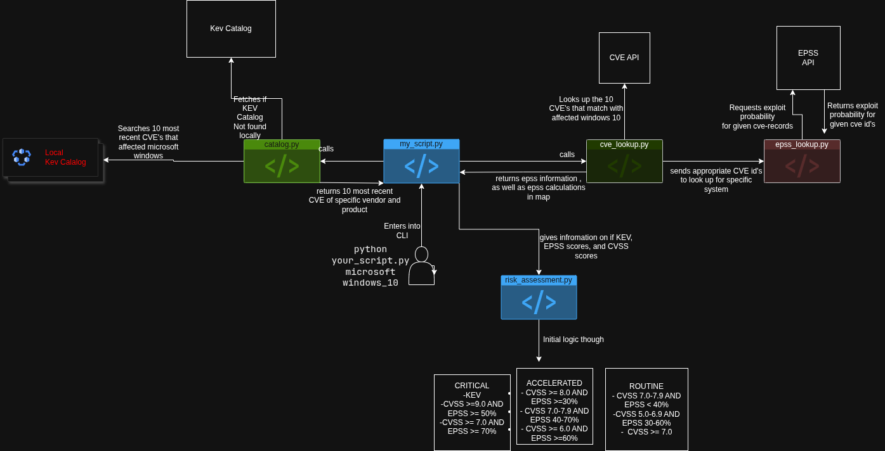
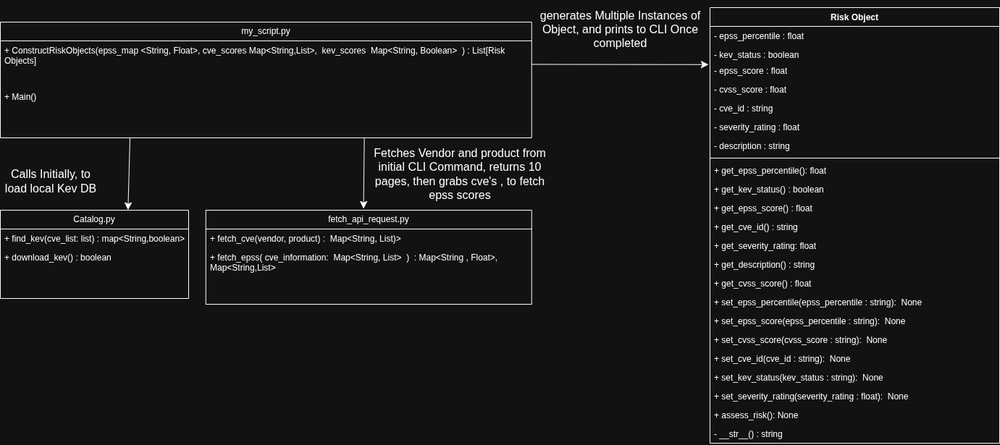

# CVE Prioritization CLI - Tool

## Setup Instructions 
- setup virtual environment and activate
  - python3 -m venv .venv
  - python -m venv .venv

- installing modules
  - pip3 install -r requirements.txt
  - pip install -r requirements.txt

- Activate virtual environment
  - source .venv/bin/activate -- Linux / Mac
  - venv_name\Scripts\activate -- Windows

- Python Version
  - I am using Python 3.13.7
  - I am using pip 25.2 

## How to run program
  - cd into src/
  - python3 my_script {vendor} {product} {h, o, a} --next {number}

## Example usage
  - python3 my_script microsoft windows_10 o --next 2  
    - returns next 10 elements from the intitial 10 given

  - python3 my_script microsoft windows o --next 3
    - returns 3rd list from 20-30 of the vulnerabilities of all  microsoft windows vulnerabilites with no specific version

  - python3 my_script adobe photoshop a
    - returns first list of vulnerabilites from adobe photoshop

## Assignment 
Build a CLI Tool that fetches the latest vulnerabilites and assigns a severity rating based on the CVSS, EPSS Score, if it is a KEV 

### Work Flow Diagram

### Design Thought process

### Severity Rating Calculation Reasoning
- Critical
  - KEV 
    - it is a critical severity rating as these are common  vulnerabilities that can be exploited.

  - CVSS Rating >= 9.0 && EPSS Score >= 50% 
      - Has a high level for possible software vulnerabilities as well as may has a 50% chance within the next 30 days
  - CVSS Rating >= 7.0 && EPSS Score >= 70% 
      - Has an above average score on software vulnerabilities as well as contains a very high likelihood of being exploited over the next 30 days according to the EPSS Score
- Accelerated
  - CVSS Rating >= 8.0 && EPSS Score >= 30%
      - Has a score High of being a potential Threat, and with a EPSS score that has potential to happen within the month
  - CVSS Rating >= 7.0-7.9 && EPSS Score 40%-70%
      - Has a high CVSS score to potentially become a greater threat as the EPSS Score has a threat to possibly occur this month 
  - CVSS Rating >= 6.0 && EPSS >= 60%
      - While the rating for CVSS Score is moderate, the EPSS score has a change greater than a coin flip to happen within the next 30 days
- Routine 
  - CVSS Rating 7.0-7.9 and EPSS Score <40%
    - While it may have a High score, it has less than a coin flip chance to occur within the month so it should still be monitered.
  - CVSS Rating 5.0-6.9 and EPSS 30%-60%
    - Has a Medium CVSS Score and potentially less than or greater than 50% change of occuring within the month, however if it is monitered it should be fine
  - CVSS Rating >= 7.0 and EPSS <= 10%
    - Has a low likelihood of occuring within the month while, the rating is high, and should be monitered we should also take into account what resources we want to spend on low risk.

### Severity Reasoning Cont.
  - Naiveness
    - Intially I was going to use if statments for the CVSS Ratings however after rereading the requirements, I came up with another way to try to mimic the diagram

  - CVSS
    - I scored CVSS with a base weight of .5 which would account for 50% as it was a way to get a good base of how high this vulnerability might score on as it takes into account AV,AC,AT,PR and, UI

  - EPSS
    - I gave this a base of .4 as 40% of the weight, as it detects how likely this requirements is to 
    happen in a given system within the month, why lower? You may have more time to try to fix this vulnerability since it may or may not happen in a month 

  - KEV
    - I gave this a base score of .1, however with I added logic to account for if it is a kev which would then multiply it by 10 to the given severity level which would then make it critical as common vulnerabilties are the most likely to become exploited.

### Road Blocks
  - API Problems 
    - I initally used the api given in the document, and they had changed their format midway through this coding excercise, which broke my code. I ended up picking another api cve shodan. 

  - Understanding CVSS, EPSS, KEV
    - I'm currently taking a course in secure software which had helped me prepare for this assignment before receiving it. I have even gone to my professor's office hours to ask questions about these topics.

  - Time Constraints 
    - I did not implment the unit test or the filtering feature though I would say the time I spend actively coding would be around ~2 hours after I had to refactor the previous api I used and did not want to go over the time constraints
  - Cleaness
    - Towards the end I was rushing so the my_script function is a little jumbled, and could definetly be refactored in a better way

### Notes
  - The api I chose did have a kev status within api however in the requirements it stated you had to go through the locally downloaded json file so it was a little redundant.

